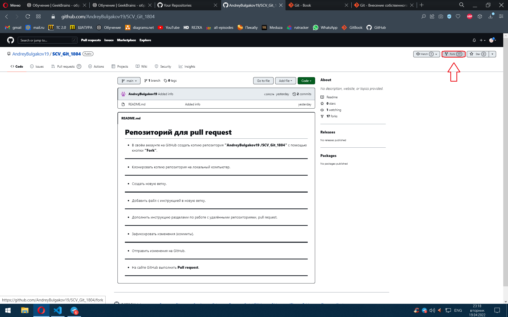
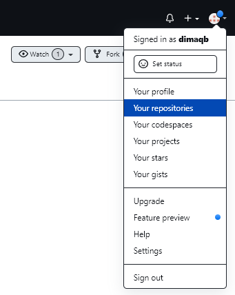
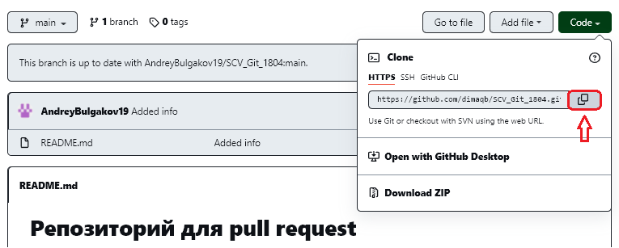

# Репозиторий для **pull request**
1. В своём аккаунте на GitHub создать копию репозитория **"AndreyBulgakov19
/SCV_Git_1804"** с помощью кнопки **"Fork"**

___
Далее перемещаемся в репозитории своего аккаунта.

___
2. Выбираем нужный репозиторий (в данном случае **SCV_GIT_1804**). 
Клонируем копию репозитория на локальный компьютер. 
Для этого сперва необоходимо скопировать ссылку.

Переходим в Visual Studio.
Выбираем нужную директорию для работы искользуя команду `cd` для перемещения. `cd ..` - предыдущая папка, `cd "folder_name"` - переход в следующую папку (необходимо указывать существующее имя папки).   
Используем команду `git clone "past_URL"` для создания клона репозитория.
Проверяем успех опирации командой `git status`
Проосматриваем существующие коммиты одной из вариаций:   
- `git log` 
- `git log --oneline`
- `git log --oneline --graph`
___
3. Создаем новую ветку.  
Для этого используем команду `git branch "branch_name"`.  
Можно проверить успех операции командой `git branch`, которая выведет все имеющиеся ветки на экран.
___
4. Редактируем файл с инструкцией в новой ветке.  
Дополняем и оформляем, используем шпаргалку по [Markdown](https://github.com/dimaqb/Markdown-Cheatsheet).
___
* Дополнить инструкцию разделами по работе с удалёнными репозиториями, pull request.
---
6. Фиксируем все изменения в ходе работы, разложив на небольшие действия. Это называется *атомарностью*.  
   
Используем команды:  
- `git commit -m "commit_name"` - Стандартная команда добавления коммита с присвоением имени на выбраную ветку.
- `git commit -a "commit_name"` - Команда включает только изменения отслеживаемых файлов (тех, которые были в какой-то момент добавлены в историю с помощью команды `git add`).  
- `git commit -am "commit_name"` - Команда для опытных пользователей с параметрами `-a` и `-m`. Эта комбинация параметров создает коммит всех проиндексированных изменений.  
- `git commit --amend -m "commit_name"` - Вместо создания нового коммита проиндексированные изменения будут добавлены в предыдущий коммит. Имя коммита будет изменено.  
  
Так же используем ветвления и слияния.  В ходе работы могут возникнуть ситуации, требующие прорабоки на разных ветках проекта.  
  
Используем команды:
- `git branch` - Cписок имеющихся у вас веток.
- `git branch "branch_name"` - Создание новой ветки с присвоением имени. 
- `git branch -v` - Посмотреть последний коммит на каждой из веток.
- `git merge "branch_name"` - Слить ветку `branch_name` с текущей.
- `git branch --merged` - Посмотреть  ветки, которые вы уже слили с текущей. 
- `git branch --no-merged` - Посмотреть  ветки, которые вы пока ещё не слили в текущую ветку.
- `git branch -d "branch_name"` - Удаление ветки без наработок (также считается слитая ветка).
- `git branch -D "branch_name"` - Удаление ветки с наработками. 
- `git branch --move "branch_name_1" "branch_name_2"` - Изменит имя ветки в вашем репозитории.  
`git push --set-upstream origin "branch_name_2"` - Изменит имя ветки в удаленном репозитории. 
- `git branch --move master main` - Переименует локальную ветку **master** в **main**.  
`git push --set-upstream origin main` - Делает переименованную ветку доступной в удалённом репозитории.   
`git push origin --delete master` - После того, как вы уьедитесь, что ветка **main** работает так же, как ветка **master**, вы можете удалить ветку **master**.
 
___
7. Отправить изменения на GitHub.  
Если ваша учетная запись ранее не была связана с [аккаунтом](https://github.com/signup?user_email=&source=form-home-signup) GitHub, выполните следующие команды:
1. `git remote add origin "urlHub"` - Создание записи о новом подключении к удаленному репозиторию.
2. `git branch -M main` - Переименовываем главную ветку в **main** (если имя ветки и так **main**, команду исключаем).
3. `git push -u origin main` - Используется для выгрузки содержимого локального репозитория в удаленный репозиторий.
___
* На сайте GitHub выполняем **Pull request**.

---

